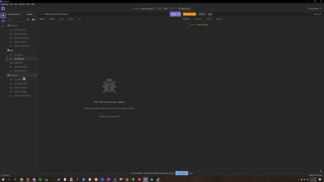
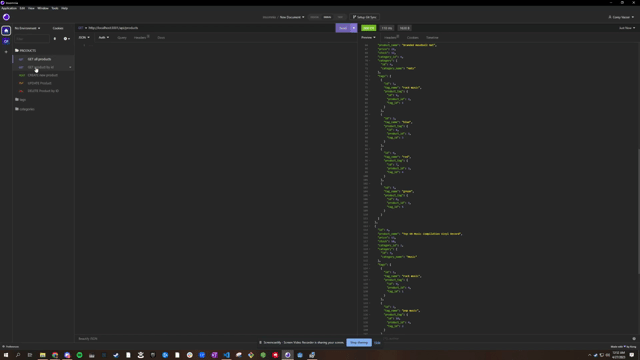
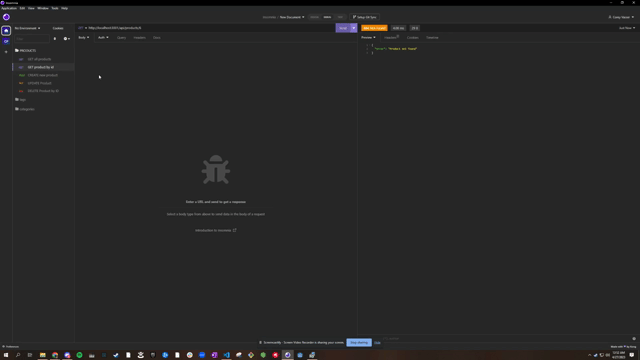

# E-commerce Backend


## Description

This is the backend for an e-commerce website. The application uses Express.js and Sequelize to create a RESTful API that interacts with a MySQL database. The API allows the user to perform CRUD operations on products, categories, and tags, as well as view product tags and category products.

## Table of Contents

- [Installation](#installation)
- [Usage](#usage)
- [Routes](#routes)
- [Dependencies](#dependencies)
- [License](#license)
- [Contributing](#contributing)
- [Tests](#tests)
- [Questions](#questions)

## Installation

To install this application, follow these steps:

1. Clone the repository from GitHub
2. Download and install MySQL from the [official website](https://dev.mysql.com/downloads/mysql/) if you haven't already done so.
   Follow the instructions provided to set up MySQL on your local machine.
3. Download and install Node.js from the [official website](https://nodejs.org/en/download) if you haven't already done so.
   Follow the instructions provided to install Node.js on your local machine.
4. Open your terminal and navigate to the root directory of the application.
5. Install the required dependencies by running `npm install`, this will install all the necessary packages and libraries required for the application to run.
6. Create a .env file in the root directory of the application and provide your database credentials. Example:

```
DB_USER='your_mysql_username'
DB_PASSWORD='your_mysql_password'
DB_NAME='ecommerce_db'
```

8. Log in to the MySQL server by running the command `mysql -u root -p` and entering your password when prompted.
9. Create the database schema by running the command `SOURCE db/schema.sql;`..

_Please note that steps 8 & 9 should be performed in a separate terminal window or tab from the one running the Node.js application._

## Usage

To use this application, follow these steps:

1. Open a terminal window and navigate to the root directory of the application.
2. Run the command `npm run seed` to seed the database with sample data.
3. Start the application by running `npm run start`.
4. Use a tool such as [Insomnia](https://insomnia.rest/) or [Postman](https://www.postman.com/) to test the various routes of the API.

For a short demonstration of the application, please refer to the [video](https://drive.google.com/file/d/1P6jclrDBn-JZTwHvc2ITkHvrgPkNnccJ/view).

## Routes

The following routes are available in the API:

### Categories

- GET /api/categories - get all categories
- GET /api/categories/:id - get a single category by ID
- POST /api/categories - create a new category
- PUT /api/categories/:id - update a category by ID
- DELETE /api/categories/:id - delete a category by ID



### Products

- GET /api/products - get all products
- GET /api/products/:id - get a single product by ID
- POST /api/products - create a new product
- PUT /api/products/:id - update a product
- DELETE /api/products/:id - delete a product by ID



### Tags

- GET /api/tags - get all tags
- GET /api/tags/:id - get a single tag by ID
- POST /api/tags - create a new tag
- PUT /api/tags/:id - update a tag
- DELETE /api/tags/:id - delete a tag by ID



## Dependencies

This project requires the following dependencies:

- [express](https://www.npmjs.com/package/express)
- [mysql2](https://www.npmjs.com/package/mysql2)
- [sequelize](https://www.npmjs.com/package/sequelize)
- [dotenv](https://www.npmjs.com/package/dotenv)

## License

This project is licensed under the MIT license. Click [here](https://opensource.org/licenses/MIT) for more information.

## Contributing

To contribute to this project, please read the installation section and ensure you have a solid understanding of the codebase. Contributions are welcome via pull requests.

## Tests

Currently, there are no automated tests for this application. Testing is performed manually.

## Questions

If you have any questions, you can reach out to me on [GitHub](https://github.com/spamdalfz) or contact me directly at coreyvasser@gmail.com.
